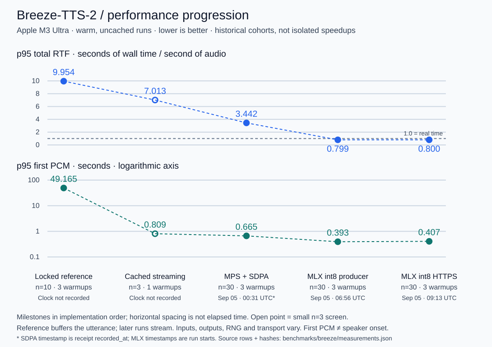
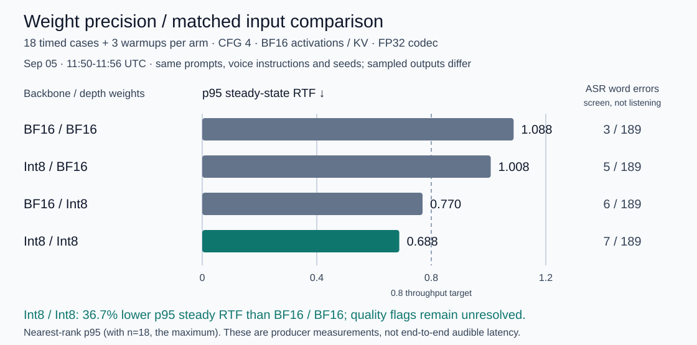

# Simo

> [!WARNING]
> **Gigaslop ahead.** This repository is a playground for experimenting with local voice
> orchestration, not production-ready software. Expect rough edges, changing interfaces, and ideas
> that may be replaced as quickly as they are tested.

Simo is an experimental local voice-agent runtime for Apple Silicon Macs. It combines a
self-hosted LiveKit audio path, local MLX models, a small native context core, and local
persistence for conversational identities and memory.

The repository now includes headless and live voice conversations, persisted aliases and memory,
a trusted-LAN mobile interface, live conversation and voice-direction controls, and a dedicated
Breeze TTS 2 performance laboratory. It is still a prototype: interfaces and stored data may
change, and the live voice path requires explicit model downloads.

## What works now

- One persisted conversational identity can run locally through STT, an MLX language model,
  Breeze speech generation, and LiveKit without sending conversation content to a hosted model.
- The LAN page works as a microphone client or a tap-to-listen interface, with mobile-sized radio
  controls, streaming Stop, completed WAV caching, and server-recorded listening results.
- Conversation instructions, voice instructions, and response-token budgets can be changed with
  **Apply now** and take effect on subsequent turns without rewriting the saved alias.
- The owned [`breeze-tts-mps`](https://github.com/mgwilt/breeze-tts-mps/tree/simo-apple-silicon)
  fork adds incremental MPS output and an experimental hybrid Torch/MLX generation path while
  retaining the upstream CUDA implementation.

## Breeze TTS performance on Apple Silicon

Recorded on an **Apple M3 Ultra with 512 GiB unified memory**. The work spans Simo's streaming
pipeline and its pinned [`breeze-tts-mps` fork](https://github.com/mgwilt/breeze-tts-mps/tree/78a79bbe7996f88766ee1885140909ca696c7055).
These are warm, uncached synthesis measurements—not completed-preview cache hits.

### Progression from the recorded evidence

Recorded p95 **total RTF fell from 9.954 to 0.800**, while p95 **first PCM fell from 49.165 s to
0.407 s** at the final HTTPS client boundary. RTF is wall time divided by generated audio duration;
less than 1 means faster than real time. The reference buffered the whole utterance before emitting
PCM, so the latency reduction combines incremental delivery with faster inference.



This is an **engineering milestone timeline, not a controlled speedup ablation**. Sample counts,
output durations, implementation and transport boundaries change. The SDPA and later MLX short
cohorts share ten prompts and seeds 17/29/42, but MLX and Torch RNG streams are not equivalent.
The earliest two receipts have no run timestamp; their positions show implementation order, not
elapsed time. First PCM is not audible speaker onset.

### What int8 contributes

The four-arm precision study holds prompts, voice instructions, seeds and generation settings
fixed: 18 timed cases plus three warmups per arm. Int8 backbone + depth weights reduce p95
steady-state RTF by **36.7%** versus BF16 weights (1.088 → 0.688), without lowering CFG.
This normalizes by each generated duration; sampled outputs are not identical.



The ASR screen flags 3/189 reference words for BF16 and 7/189 for int8. Those are unadjudicated
recognizer errors, not human quality scores; matched listening remains open. The experimental Fast
candidate is available for operator testing, not release-accepted.

### Measured streaming envelope

The later same-host, uncached HTTPS suite contains **252 timed outputs across ten cohorts**, with
three warmups per cohort: default short/long text and three voice instructions, each with and
without Simo's other model weights resident. Residency means idle loaded weights, not concurrent
STT/LLM inference.

| Measurement | Recorded result | Scope |
| --- | --- | --- |
| p95 steady-state RTF | **0.685–0.698** | Range of ten cohort p95s; after first PCM |
| p95 first PCM | **0.312–0.428 s** | HTTPS client arrival, not browser or acoustic onset |
| Resident/control output consistency | **126/126 timed pairs byte-identical** | Same prompts, instructions and seeds |
| Playback underruns | **0 in arrival replay** | Modeled player with 640 ms reserve; not physical-device proof |
| Fresh-process launch → ready | **8.329–9.157 s** | Separate three-launch study; not OS/disk-cold startup |
| First request / warm request → PCM | **0.939–1.337 s / 0.280–0.304 s** | Three first-use and nine warm requests; ranges, not p95 |

The throughput target is p95 steady-state RTF ≤0.8. The separate ≤2 s tap-to-audible-playback,
physical underrun and perceptual gates are **not established** by these measurements. Same-host
HTTPS does not characterize mobile Wi-Fi jitter.

### Inference implementation

The owned fork and Simo integration currently use this hybrid path—not a full MLX rewrite:

```text
text + voice instruction
  -> PyTorch BF16 text preparation
  -> MLX int8 backbone and depth generation
  -> PyTorch FP32 stateful codec decoding
  -> bounded PCM streaming
  -> LiveKit or browser playback
```

| Component | Technical specification |
| --- | --- |
| Checkpoint | `BreezeBlue/Breeze-TTS-2` at `799624c0b4a1daa8db6d28bbd9850043c0270734` |
| Transformer geometry | T5Gemma2 encoder: 26 layers / hidden 1,152. Qwen3 backbone: 28 layers / hidden 2,048 / 16 query, 8 KV heads. Depth: 12 layers / hidden 1,024 / 8 query, 2 KV heads |
| CFG execution | Separate Torch conditional/unconditional prefills; one-time rotated-KV transfer; paired MLX backbone/depth decoding with CFG **4** |
| Weight-only quantization | Affine int8, group size **64**, **196 backbone + 84 depth = 280 linear weights**; BF16 activations and KV |
| Selected weight storage | **3,485,466,624 → 1,851,654,144 bytes (−46.875%)**, including packed scales/biases; excludes embeddings, norms, projectors, custom/output heads and codec |
| Cache and compilation | Backbone KV grows in 128-position blocks, separate branch positions/masks, 4,096-position candidate limit; compiled backbone step and 15-codebook depth loop, SDPA; depth KV resets per audio frame |
| Sampling | Temperature 0.9, top-k 50, top-p 1.0; explicit MLX seed, EOS termination, maximum 750 iterations; no lower-CFG speed claim |
| Codec and wire format | Qwen3 TTS Tokenizer V2, **16 codebooks**, 24 kHz mono PCM16LE; **1,920 samples / 80 ms** per complete frame, stateful incremental decoding |
| Streaming lifecycle | Four-frame producer queue, one active inference request; bounded browser playback, Stop/disconnect cancellation, completed-only preview caching |
| Recorded dependencies | Torch **2.9.1**, Transformers **4.57.3**, qwen-tts **0.1.1**, MLX / MLX-Metal **0.32.0**; Metal library artifacts SHA-256 pinned |

The weight-storage reduction is **not total process memory savings**: this hybrid still retains
the Torch model. The tested 512 GiB machine is not a minimum-memory requirement. The fork retains
upstream CUDA code, but these results validate only this Apple Silicon path.

[Benchmark methods and source map](benchmarks/breeze/README.md) ·
[All cohort results](benchmarks/breeze/results.md) ·
[397 timed measurement rows and receipt hashes](benchmarks/breeze/measurements.json)

Regenerate the charts from checked-in data, without models or network access:

```sh
python3 scripts/render_breeze_benchmarks.py
python3 scripts/render_breeze_benchmarks.py --check
```

## Local model matrix

These are the default models selected in `python/simo/config.py`. Each model ID and revision can be
overridden through the corresponding `SIMO_*_MODEL` and `SIMO_*_REVISION` environment variables.

| Role | Default model | Runtime | Intent |
| --- | --- | --- | --- |
| Speech to text | `mlx-community/parakeet-tdt-0.6b-v3` | Parakeet MLX | Transcribe local microphone or room audio |
| Language model | `mlx-community/Qwen3.5-4B-4bit` | MLX-LM | Generate context-aware replies with a configurable response budget |
| Text to speech | `BreezeBlue/Breeze-TTS-2` | PyTorch prefill plus MLX candidate; PyTorch rollback | Generate incremental designed speech locally |
| Voice activity detection | Silero VAD | LiveKit Agents Silero plugin | Detect speech turns and interruptions before transcription |

The setup script pins exact revisions and requires an explicit flag before downloading model
weights. Run `uv run python scripts/setup_models.py` to inspect the current plan.

## Requirements

For the headless and deterministic paths:

- macOS
- Python 3.11, 3.12, or 3.13
- [uv](https://docs.astral.sh/uv/)
- Apple Command Line Tools or Xcode

Live voice also requires an Apple Silicon Mac, LiveKit Server, and the optional MLX dependencies
and models described below. Breeze-TTS-2 use is subject to its separate non-commercial model
license.

## Setup

```sh
git clone --recurse-submodules https://github.com/mgwilt/simo.git
cd simo
uv sync --extra runtime
uv run python scripts/build_native.py
uv run python scripts/setup_live_data.py
uv run simo doctor
```

Run a deterministic, no-model turn through the context pipeline:

```sh
uv run simo headless \
  --transcript "hello" \
  --transcript "remember that the door is blue"
```

Create a persisted alias and conversation without opening an audio device:

```sh
uv run simo alias create Ada --summary "An analytical conversationalist" --json
uv run simo talk --alias <alias-id> \
  --turn "Hello" \
  --turn "Remember that the door is blue"
uv run simo conversation list --alias <alias-id>
```

## Live voice

Install LiveKit Server and the optional inference dependencies:

```sh
brew install livekit
uv sync --extra runtime --extra inference
```

Model downloads are opt-in. The first command prints the pinned revisions, expected download size,
and required free space; it does not download anything.

```sh
uv run python scripts/setup_models.py
uv run python scripts/setup_models.py --accept-download
```

Check the local runtime, then start a headset conversation:

```sh
uv run simo doctor --mode models
uv run simo prove-models
uv run simo doctor --mode live
uv run simo talk --alias <alias-id> --human-name "Local user"
```

`talk` starts a loopback-only LiveKit server and uses the system-default microphone and speaker.
Press `Ctrl-C` once to stop. The command prints the conversation ID so the transcript can be
reviewed or exported:

```sh
uv run simo conversation show <conversation-id>
uv run simo conversation export <conversation-id> ./conversation.json
```

See the [headset operation guide](docs/operations/livekit-headset-talk.md) for device selection,
resuming conversations, and the current verification boundary.

## LAN browser voice

The browser site serves one persisted alias to one Mac, iPhone, or iPad on the same trusted local
network. It uses HTTPS/WSS, retryable room tokens for one fixed browser identity, audio-only counterpart allow lists, and
keeps Breeze and internal services on loopback.

```sh
brew install caddy mkcert
uv sync --project services/breeze --frozen
pnpm --dir web install --frozen-lockfile
pnpm --dir web build
uv run python scripts/setup_lan_tls.py
uv run python scripts/setup_lan_tls.py --accept-install

services/breeze/.venv/bin/python services/breeze/serve.py \
  .models/Breeze-TTS-2 --host 127.0.0.1 --port 7860 --device mps

uv run simo serve --alias <alias-id> \
  --cert .artifacts/lan-tls/simo-lan.pem \
  --key .artifacts/lan-tls/simo-lan-key.pem
```

The mic-free cards stream PCM incrementally and support Stop; completed renders remain cached as
WAVs. The live-control panel uses radio buttons for response budgets and voice choices, while
**Apply now** updates the running process immediately. Listening ratings, preferences, notes, and
attempt diagnostics autosave to a private local result store, so phone testing does not require
downloading and re-uploading a report.

Quality remains the default startup mode and preserves requested CFG. The reserved
`--performance-mode fast` selector still fails closed until formal release gates pass, but an
operator can manually test the working `mlx-int8-v1` candidate today. Start it on port 7861:

```sh
PYTHONPATH=vendor/breeze-tts UV_CACHE_DIR=/private/tmp/simo-uv-cache \
uv run --offline --project services/breeze --frozen --with mlx==0.32.0 \
  python services/breeze/serve.py .models/Breeze-TTS-2 \
  --host 127.0.0.1 --port 7861 --device mps \
  --experimental-recipe mlx-int8-v1
```

Then start the normal conversation server in another terminal with the candidate endpoint:

```sh
SIMO_BREEZE_ENDPOINT=http://127.0.0.1:7861/v1/audio/speech \
uv run simo serve --alias <alias-id> \
  --cert .artifacts/lan-tls/simo-lan.pem \
  --key .artifacts/lan-tls/simo-lan-key.pem
```

Use a schema-v2 Breeze voice-design alias with CFG 4 and a uint32 seed. The candidate currently
supports voice design, not reference-audio cloning. `--engine reference` restores full-utterance
generation, and `SIMO_TTS_BACKEND=qwen` selects the former MLX-Audio backend in a new process.

Performance is tracked separately in [Breeze MPS performance](docs/work/W-20260904-breeze-mps-performance/).
See the [LAN operation guide](docs/operations/lan-voice-site.md) for setup, server-recorded listening,
and scripted verification without computer use. One known rough edge remains: **End conversation**
currently stops the supervising `simo serve` process, so restart that command before reconnecting.

## Commands

| Command | Purpose |
| --- | --- |
| `simo doctor` | Check headless, model, or live prerequisites |
| `simo headless` | Run deterministic transcript turns without local models |
| `simo alias` | Create, revise, export, and import conversational aliases |
| `simo conversation` | Create, inspect, export, resume, and delete conversations |
| `simo memory` | Inspect, correct, and forget retained claims |
| `simo talk` | Run synthetic turns or a local LiveKit headset session |
| `simo serve` | Serve one alias to one trusted-LAN HTTPS/WSS browser |
| `simo breeze` | Inspect and benchmark the local Breeze-TTS-2 sidecar |
| `simo lab` | Run bounded LiveKit and multi-alias experiments |
| `simo prove-models` | Exercise the configured STT, text, and TTS models without audio devices |

Run `uv run simo <command> --help` for command-specific options.

## Local data and privacy

Simo stores aliases, conversations, and retained claims in the platform application-data directory
(`~/Library/Application Support/Simo` on macOS). Use `--data-dir` or `SIMO_DATA_DIR` to select a
different location.

Raw audio is not retained. Conversation commands do persist transcript text and timing data, and
headless JSON output includes transcripts supplied on the command line. Runtime caches, downloaded
models, generated audio, and local data are ignored by Git.

## Development

Install the development dependencies and run the repository checks:

```sh
uv sync --extra runtime --extra inference --extra dev
uv run python scripts/build_native.py
uv run python -m unittest discover -s tests/python -v
uv run basedpyright
uv run ruff check python/simo tests/python scripts
uv run ruff format --check python/simo tests/python scripts
uv run python scripts/validate_docs.py
uv run python -m unittest discover -s scripts/knowledge/tests -v
git diff --check
```

The main source directories are:

- `python/simo/` — command-line interface and Python runtime code
- `include/` and `src/` — native context core
- `tests/` — Python and native tests
- `docs/` — architecture, interfaces, operations, and active work
- `vendor/` — pinned upstream submodules

Start with the [documentation index](docs/index.md) for architecture and operating details.
